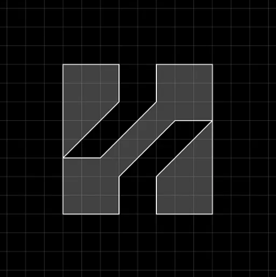
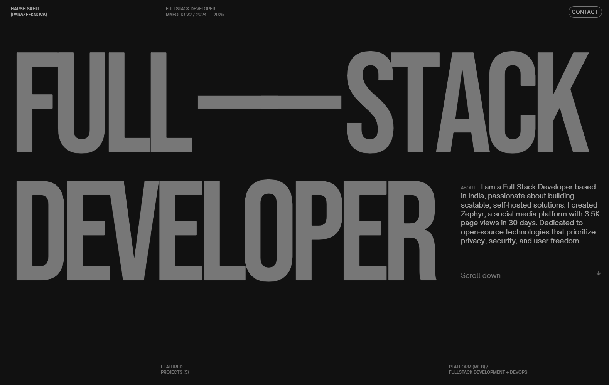

<div align="center">

  <a href="https://github.com/parazeeknova/myfolio-v2">
    
  </a>
  <br>

</div>

<div align="center">

  <a href="https://folio.zephyyrr.in"><h1>MyFolio - v2</h1></a>

  **The second iteration of my portfolio website**  
  A simple, minimalistic, and self-hosted showcase of my projects and skills.

</div>

---

### 🚀 About  
MyFolio is a clean and minimal portfolio designed to highlight my work, skills, and projects in a distraction-free manner.



### 🛠️ Local Development  

To run MyFolio locally, follow these steps:

```bash
yarn install
# then
yarn dev
```

Check out my first iteration of the portfolio [here](https://dev.zephyyrr.in).

